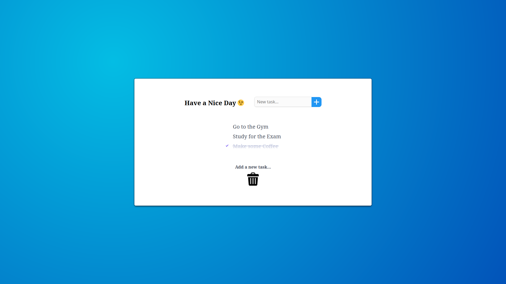

# To Do Web App

Esse serviço foi desenvolvido para fins de estudo. Nele o usuário pode criar sua conta e adicionar tarefas a serem realizadas, podendo marcar como concluídas ou deletar a tarefa.

## Screenshots

- Tela principal da Aplicação.

## Tech Stack

**Client:** Javascript, HTML, CSS

**Server:** Node.js, Express, PostgreSQL

## Competências

Durante o desenvolvimento deste projeto, apliquei algumas competências importantes. Abaixo estão os principais tópicos abordados:

- **CRUD com Banco de Dados PostgreSQL**.
- **Rotas Cliente-Servidor**: Uso de rotas RESTful para comunicação entre o frontend e backend, garantindo que as requisições e respostas sejam tratadas corretamente.
- **Deploy com Heroku**.
- **Autorização com Bcryptjs**: Implementação de mecanismos de autorização segura, criptografando senhas e validando-as para controle de acesso do usuário.

Ferramentas de Desenvolvimento:

- **Eslint**: Para organização do código.
- **Winston (Logger)**: Captura de informações importantes do serviço.

## Funcionalidades

- Adicionar tarefas a serem realizadas.
- Autorização de usuário com Login e Senha.
- Marcar tarefas como concluídas.
- Interface intuitiva e responsiva desenvolvida apenas com CSS e HTML.

## Utilização

**Nota de Segurança**: A versão atual desta aplicação não é totalmente segura para uso. Embora a criptografia de senhas esteja implementada usando bcrypt, recursos de segurança adicionais, como OAuth e criptografia avançada, não estão configurados. Use este serviço com cautela se estiver lidando com dados sensíveis.

O serviço está disponível via Heroku para fácil acesso. Você pode visitar a aplicação aqui: [To Do Web App](https://to-do-app-np-7e816f104332.herokuapp.com/).

